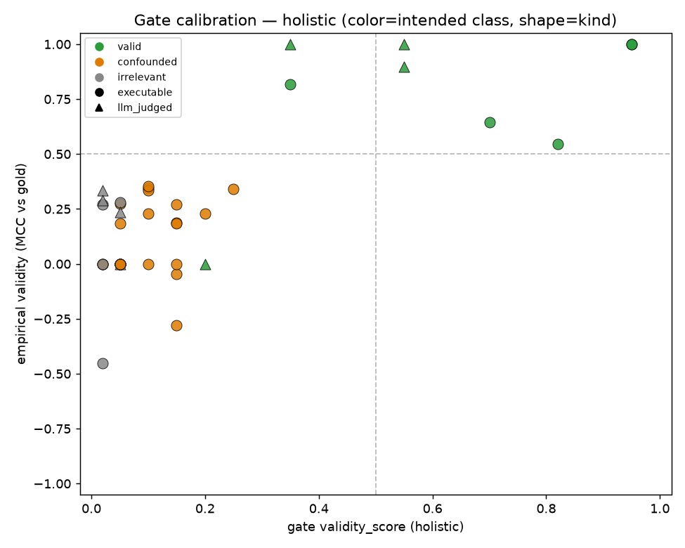
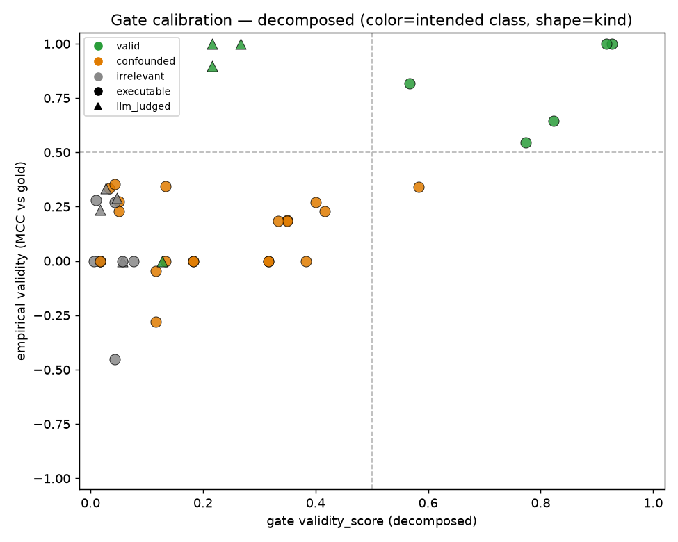

# Experiment 1 verdict: AMBIGUOUS

**rho=0.368 (CI lower 0.064), AUROC=0.894 (CI lower 0.763): between kill and greenlight, or CIs cross the kill thresholds. Proceed to Experiment 2 with tempered expectations.**

Primary variant: decomposed gate — rho **+0.368** (95% CI [+0.064, +0.611]), AUROC **0.894** (95% CI [0.763, 1.000]), n=41 — 1/2000 bootstrap resamples were degenerate and skipped; read this CI with suspicion.
Decision rule (SPEC.md section 0): greenlight iff rho >= 0.5 AND AUROC >= 0.75 with CIs excluding the kill thresholds (rho <= 0.2, AUROC <= 0.6).

## Headline numbers

| gate variant | Spearman rho [95% CI] | AUROC [95% CI] | confounded-class recall | mean vote variance |
|---|---|---|---|---|
| holistic | +0.545 [+0.238, +0.771] | 1.000 [1.000, 1.000] | 1.00 (n=20) | 0.0002 |
| decomposed | +0.368 [+0.064, +0.611] | 0.894 [0.763, 1.000] | 0.95 (n=20) | 0.0014 |

**Confounded-class recall** — of proxies the author labeled confounded whose empirical validity came out low, the fraction the gate scored below 0.5. Catching confounded proxies is the whole product; this is the single most important diagnostic (small n, read with care).

## Calibration

A gate that tracks truth shows an upward trend; a guessing gate is a cloud. Orange (confounded) points in the lower-right quadrant are gate failures on the crux cases.

## Executable vs llm_judged proxies

**holistic:**
- executable: rho **+0.582** (95% CI [+0.256, +0.809]), AUROC **1.000** (95% CI [1.000, 1.000]), n=33 — 5/2000 bootstrap resamples were degenerate and skipped; read this CI with suspicion
- llm_judged: rho **+0.515** (95% CI [-0.258, +0.841]), AUROC **1.000** (95% CI [1.000, 1.000]), n=8 — 42/2000 bootstrap resamples were degenerate and skipped; read this CI with suspicion

**decomposed:**
- executable: rho **+0.453** (95% CI [+0.082, +0.733]), AUROC **0.993** (95% CI [0.963, 1.000]), n=33 — 5/2000 bootstrap resamples were degenerate and skipped; read this CI with suspicion
- llm_judged: rho **+0.588** (95% CI [-0.277, +0.936]), AUROC **1.000** (95% CI [1.000, 1.000]), n=8 — 42/2000 bootstrap resamples were degenerate and skipped; read this CI with suspicion

## Per-task breakdown

**holistic:**

| task | rho | AUROC | n |
|---|---|---|---|
| billing_schema | +0.690 | 1.000 | 10 |
| csv_parser | +0.445 | 1.000 | 10 |
| sql_ltv_top10 | +0.580 | 1.000 | 11 |
| sql_revenue_by_tier | +0.466 | 1.000 | 10 |

**decomposed:**

| task | rho | AUROC | n |
|---|---|---|---|
| billing_schema | +0.549 | 0.750 | 10 |
| csv_parser | +0.226 | 1.000 | 10 |
| sql_ltv_top10 | +0.400 | 0.917 | 11 |
| sql_revenue_by_tier | +0.341 | 0.875 | 10 |

## Population balance (spec section 3)

| task | outputs | gold pass | gold fail | pass rate |
|---|---|---|---|---|
| sql_ltv_top10 | 20 | 8 | 12 | 0.4 |
| sql_revenue_by_tier | 16 | 7 | 9 | 0.438 |
| billing_schema | 17 | 6 | 11 | 0.353 |
| csv_parser | 14 | 6 | 8 | 0.429 |

## Per-proxy detail

| proxy | class | kind | empirical validity (MCC) | gate holistic | gate decomposed |
|---|---|---|---|---|---|
| billing_schema::llm_contract_check | valid | llm_judged | +1.00 | 0.55 | 0.27 |
| billing_schema::battery_accepts_rejects | valid | executable | +0.55 | 0.82 | 0.77 |
| billing_schema::seats_integer_min1 | confounded | executable | +0.34 | 0.25 | 0.58 |
| billing_schema::additional_props_false | confounded | executable | +0.27 | 0.15 | 0.40 |
| billing_schema::has_annotations | irrelevant | executable | +0.27 | 0.02 | 0.04 |
| billing_schema::required_has_tenant | confounded | executable | +0.18 | 0.05 | 0.35 |
| billing_schema::status_enum_exact | confounded | executable | +0.18 | 0.15 | 0.33 |
| billing_schema::parses_as_schema | confounded | executable | +0.00 | 0.10 | 0.18 |
| billing_schema::nesting_depth | irrelevant | executable | +0.00 | 0.05 | 0.08 |
| billing_schema::llm_professional | irrelevant | llm_judged | +0.00 | 0.05 | 0.06 |
| csv_parser::own_fixtures_pass | valid | executable | +0.65 | 0.70 | 0.82 |
| csv_parser::text_handles_quotes | confounded | executable | +0.35 | 0.10 | 0.04 |
| csv_parser::llm_code_quality | irrelevant | llm_judged | +0.29 | 0.02 | 0.05 |
| csv_parser::simple_case_correct | confounded | executable | +0.00 | 0.15 | 0.38 |
| csv_parser::runs_on_quoted_input | confounded | executable | +0.00 | 0.02 | 0.13 |
| csv_parser::defines_and_runs | confounded | executable | +0.00 | 0.05 | 0.18 |
| csv_parser::text_strips_fields | confounded | executable | +0.00 | 0.05 | 0.02 |
| csv_parser::has_type_hints | irrelevant | executable | +0.00 | 0.02 | 0.06 |
| csv_parser::llm_contract_correct | valid | llm_judged | +0.00 | 0.20 | 0.13 |
| csv_parser::under_60_lines | irrelevant | executable | -0.45 | 0.02 | 0.04 |
| sql_ltv_top10::exec_matches_ref | valid | executable | +1.00 | 0.95 | 0.93 |
| sql_ltv_top10::llm_ltv_semantics | valid | llm_judged | +0.90 | 0.55 | 0.22 |
| sql_ltv_top10::exec_top_row_matches | valid | executable | +0.82 | 0.35 | 0.57 |
| sql_ltv_top10::text_order_desc_limit10 | confounded | executable | +0.34 | 0.10 | 0.13 |
| sql_ltv_top10::text_uses_cte | irrelevant | executable | +0.28 | 0.05 | 0.01 |
| sql_ltv_top10::text_mentions_refund | confounded | executable | +0.27 | 0.05 | 0.05 |
| sql_ltv_top10::llm_readability | irrelevant | llm_judged | +0.24 | 0.05 | 0.02 |
| sql_ltv_top10::exec_returns_10_rows | confounded | executable | +0.19 | 0.15 | 0.35 |
| sql_ltv_top10::exec_no_error | confounded | executable | +0.00 | 0.05 | 0.32 |
| sql_ltv_top10::text_under_20_lines | irrelevant | executable | +0.00 | 0.05 | 0.02 |
| sql_ltv_top10::text_has_group_by | confounded | executable | -0.28 | 0.15 | 0.12 |
| sql_revenue_by_tier::exec_matches_ref | valid | executable | +1.00 | 0.95 | 0.92 |
| sql_revenue_by_tier::llm_net_revenue_semantics | valid | llm_judged | +1.00 | 0.35 | 0.22 |
| sql_revenue_by_tier::text_order_desc | confounded | executable | +0.33 | 0.10 | 0.03 |
| sql_revenue_by_tier::llm_readability | irrelevant | llm_judged | +0.33 | 0.02 | 0.03 |
| sql_revenue_by_tier::exec_returns_3_rows | confounded | executable | +0.23 | 0.20 | 0.42 |
| sql_revenue_by_tier::text_mentions_refund | confounded | executable | +0.23 | 0.10 | 0.05 |
| sql_revenue_by_tier::exec_no_error | confounded | executable | +0.00 | 0.05 | 0.32 |
| sql_revenue_by_tier::text_under_15_lines | irrelevant | executable | +0.00 | 0.05 | 0.02 |
| sql_revenue_by_tier::text_uppercase_keywords | irrelevant | executable | +0.00 | 0.02 | 0.01 |
| sql_revenue_by_tier::text_group_by_tier | confounded | executable | -0.05 | 0.15 | 0.12 |

## Caveats (spec section 9)

- Thin n (41 proxy datapoints): CIs are wide by design; do not over-read the point estimates. A clearly-positive or clearly-null result is trustworthy at this n; a marginal one is not.
- **Easy-case caveat**: a positive result means the gate works where ground truth exists. Necessary, not sufficient — Experiment 2 (adversarial confounded-vs-valid pairs in genuinely ungrounded domains) is the real test. Do not over-update on a greenlight.
- Gold trustworthiness was spot-checked in code: reference outputs pass, every breaking mutation fails, every surface mutation passes (tests/test_exp1.py).

Config: {"generated_at": "2026-07-19T20:03:56.917879+00:00", "mock": false, "smoke": false, "gate_model": "claude-sonnet-4-6", "votes": 3, "variants": ["holistic", "decomposed"], "task_ids": ["sql_ltv_top10", "sql_revenue_by_tier", "billing_schema", "csv_parser"], "sampled_per_task": 0}

Every number above is reconstructable from `exp1_raw.json`.